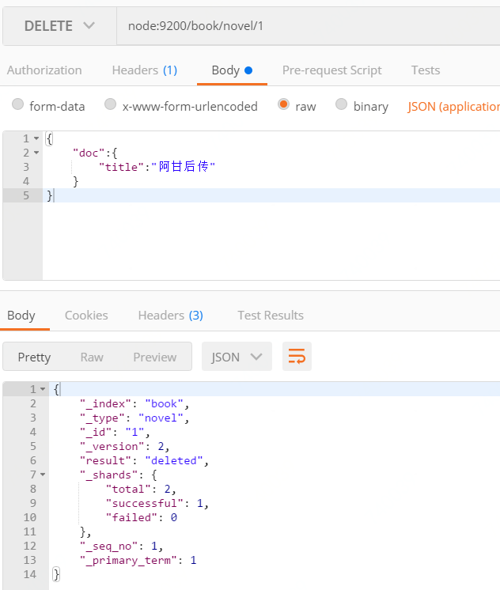
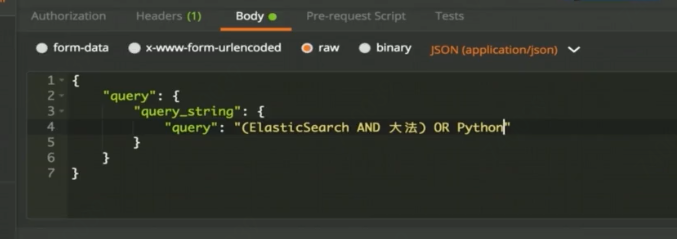

### elasticsearch学习笔记

##### 基础概念

- 索引：含有相同属性的文档集合(类似于数据库概念里面的数据库)

- 类型 ：索引可以定义一个或者多个类型，文档必须属于一个类型(数据库里面的表的概念)

- 文档：文档是可以被索引的基本数据单位 (类似表中的一条记录)

- 例如：搜索引擎有汽车索引，图书索引等等;图书索引里面有包含科技类型，小说类型等;科技图书中有es权威指南，es权威指南则为一个文档。  

- 分片： 每一个索引可以有多个分片，每一个分片是一个Lucene索引，分片可以水平拓展(即添加节点时水平拓展，分片数量只能在创建索引时候指定)

- 备份：拷贝一个分片就完成了分片的备份  (主分片失败则备份分片可以用于容错)

##### 基本语法

- API基本格式：http://ip:port/索引/类型/文档id

- 常用Http的动词： GET/PUT/POST/DELETE

- 索引创建：非结构化创建与结构化创建

非结构化索引：  

		非结构化索引："mappings": { } 其中value为空

结构化索引定义：  

	其中book是索引，novel是类型，title是文档

查看结构化索引：  

  

此时的mappings已经不为空，则为结构化索引。

指定文档id插入文档：  

未指定文档id插入文档：  

- 修改文档：  

指定文档id：  

- 文档删除：  

  

也可以head插件删除。

- 索引删除：  

	http DELETE方法：http:ip:port/索引  可以直接删除索引，删除索引操作是一个危险操作。

- 根据文档id进行文档查询： 

  

- 匹配所有数据进行查询：  

  

- 具体条件进程查询：

  

其中title为文档，即文旦各种包含java的关键字。
注意细节区别，具体条件查询使用的是match而全部查询使用的是match_all关键字，本例子中查询的文档中包含java关键的查询。  查询还有更多字段，例如根据什么字段进行排序等。  

- 聚合查询：

例如场景：想根据数据的字数进行聚集，就是根据字数进行group，返回的是各个字数书籍对应的本数。具体自行查阅。  

- 高级查询：  

子条件查询： 特定字段特定值查询  

  

  

  

查询作者和标题中包含有瓦力关键字的条目。

   

包含ElasticSearch与大法关键字的查询。  

拓展：  

 

 

结构化查询:

 

 

- 子条件查询的Filter Context：  

filter 查询：

filter查询与query查询：filter只对数据做过滤并且会缓存，因此filter较query会快一些。  

- 复合查询 

ES全文搜索，没有指定索引与类型因此为全文搜索：  

  

还有固定分数查询等，具体请查阅官方文档。  

##### ElasticSearch实战

- 待补充

