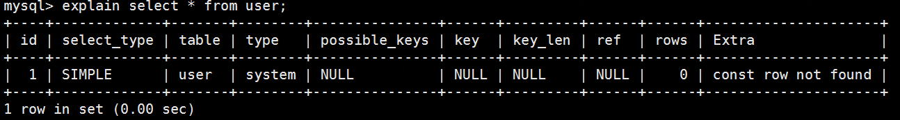
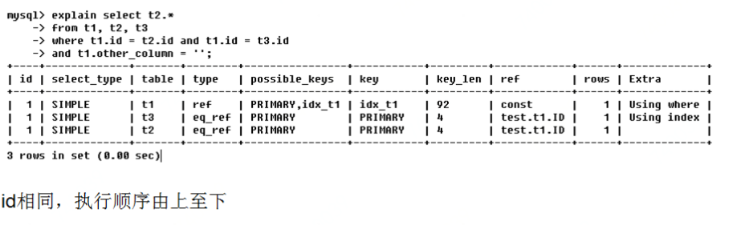
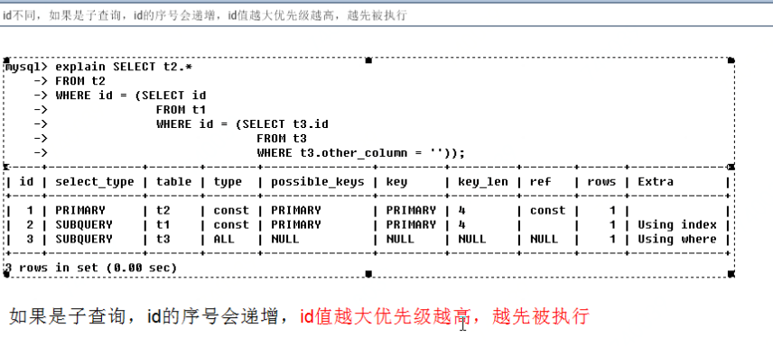
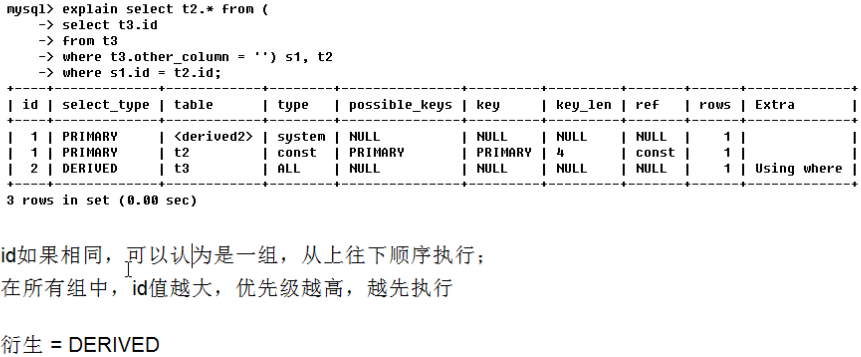
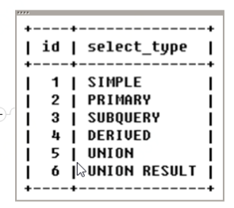
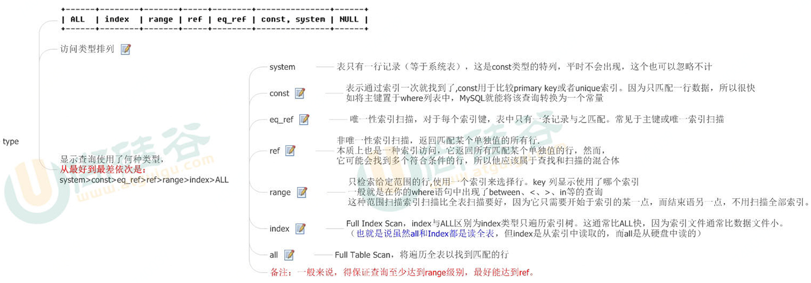

### MYSQL高级学习笔记

##### MYSQL的架构介绍

- 前身  

			MYSQL是由瑞典MYSQL AB公司开发，目前归属Oracle。
- SQL特点  
			
			易学难精，写出一条高效简洁的SQL还是比较困难的。

- 高级MYSQL
			
			MYSQL内核，大公司内部自行会优化MYSQL内核
			SQL优化
			MYSQL参数优化
			MYSQL主从复制
			软硬件升级
			容灾备份
			SQL编程

- 设置mysql开机启动
		
		chkconfig mysqld on		
		chkconfig --list |grep mysql 

- 解决中文乱码修改配置文件,client表示客户端，mysqld表示服务端
		
		/etc.my.cnf
			
			[client]
			default-character-set=utf8

			[mysqld]
			collation_server=utf8_general_ci
			character_set_server=utf8
			character_set_client=utf8
			
注意：如果修改完编码之后依旧不生效，原因可能是由于数据库在编码之前创建的，所以需要修改数据库编码。

- MYSQL架构图

架构优点：插拔式的存储架构将查询和其他系统的任务进行分离。	

	

架构分层：连接层，服务层，引擎层，存储层

- MYSQL存储引擎

	  

	  

mysam与innodb引擎区别：

	  

MySam比Innbo性能好的原因是MySam没有事务

##### MYSQL索引优化分析

- 数据库性能差，SQL变慢，执行时间长，等待时间长  
导致原因：SQL写的烂，索引失效，关联查询太多，服务器参数设置不合理(缓冲区与线程数等)

- 创建索引语句

单值索引：
	 

多值索引：

		create index index_user_id_name on user(id,name)

- SQL解析过程：

	  

- SQL的join写法以及区别  

	

- 索引简介  

当面试提及索引时候切勿拿书的目录做类似，忌讳。  

索引的定义：索引是帮助数据库高效获取数据的数据结构。(核心：索引是一种数据结构)  

索引用于：记录排序与提高查找效率  

提否提高查找效率：主要是看where条件是否使用了索引。

索引会影响where条件以及排序order by。

互联网公司一般数据删除都是逻辑删除，而不是真实删除，这么做好处：1：为了数据分析，2：为了索引，因为真实删除数据会导致索引频繁更新。

频繁删改的字段不适合创建索引，因为字段变动会导致索引变动。

索引的优劣：  
  	
	

索引的分类：  
  	

查看已知表上的索引：  
  	

- 那些字段适合创建索引：   

			1：主键自动创建唯一索引
			2：频繁查询的条件应当创建索引
			3：查询过程中与其他表关联的字段，外键关系适合创建索引
			4：频繁更新的字段不适合创建索引，因此更新数据的同时也要更新索引，性能会差
			5：Where条件用不到的条件不要创建索引
			6：单键索引/组合索引选择的问题？在高并发时候适合创建组合索引
			7：查询过程中排序的字段适合创建索引，排序字段若通过索引去访问将大大提高排序的速度(但是索引的排序规则需与你的order by规则一)

- 那些字段不适合创建索引：  

			1：表记录太少，不要创建索引。一般300W左右性能开始下降，所以一般超过300W就要考虑创建索引
			2：经常增删改的表不要创建索引，原因：虽然索引可以提高查询效率，但是影响更新效率，因为更新数据同时还要更新索引，所以不要创建索引
			3：如果某一个数据列包含许多重复的内容的话，为它创建索引就没有太大的实时效果。例如：性别，国籍等，具体选择参考如下图。

- MySQL优化器如何优化SQL查询

- MYSQL常见瓶颈  

			CPU瓶颈：在CPU饱和的时候一般瓶颈发生在数据装载到内存或从磁盘上读取数据处  
			IO瓶颈：磁盘IO瓶颈通常发生在装入的数据量远大于内存容量的时候
			服务器的硬件性能瓶颈：top,free,iostat,vmstat来查看系统的性能状态

当通过命令分析发现不是上面问题时候就需要使用explain命令进行问题定位

- EXPLAIN命令  

		explain命令是什么：使用explain关键字可以模拟优化器执行SQL查询语句，从而知道MySQL是如何处理你的SQL语句的，分析你的查询语句或是表结构的性能瓶颈。  
		explain命令能做什么：1、表的读取顺序，2、数据读取操作的操作类型，3、哪些索引可以使用，4、哪些索引被实际使用，5、表之间的引用，6、每张表有多少行被优化器查询  
		explain命令怎么样：explain + sql语句

explain 查询结果：  

explian查询结果字段分析：  

- *1：id字段*  

  

  

  

*注意：图中的s1是表的别名*   

- *2：select_type字段*  
  

- *3：table字段*  
这一行数据主要是表示关于哪一张表的。

- *4：type字段*  
  

性能分析

索引优化

##### MYSQL查询截取分析

查询优化

慢查询日志

批量数据脚本

show profile

全局查询日志

##### MYSQL主从复制

##### MYSQL的锁机制

行锁

表锁

页锁