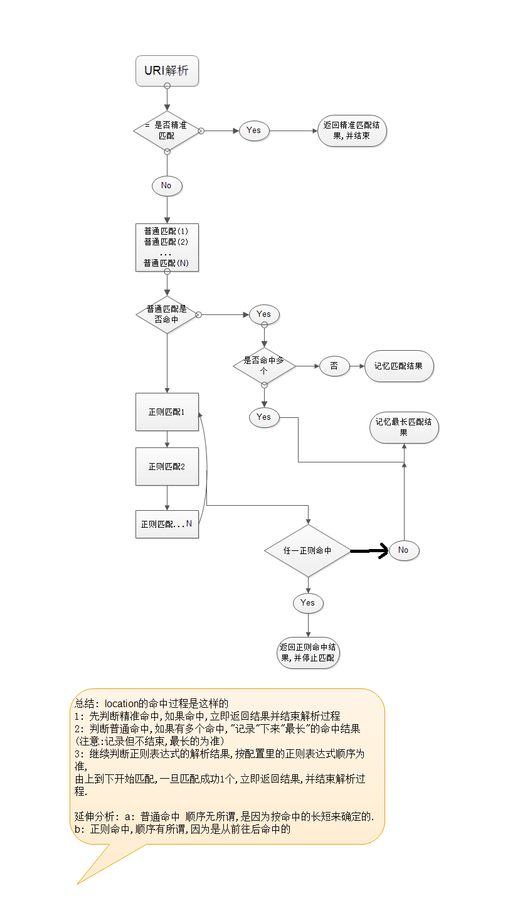
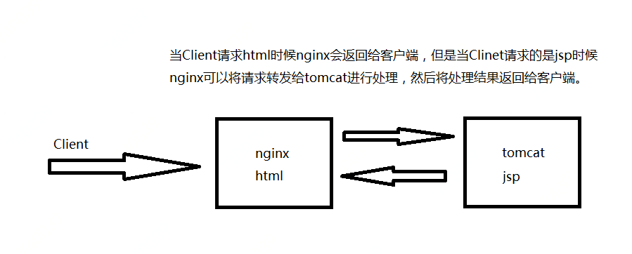

## nginx学习笔记(2)
#### nginx日志管理
- nginx允许根据不同的server进行不同的log配置，nginx的server配置段可以看到access.log的配置信息如下：

        access_log  logs/host.access.log  main;

其中access_log说明该日志是访问日志，后面是日志的存储位置，main是指日志的格式。除了main格式还可以定义其他格式，main格式是定义好的一种日志格式，我们还可以定义其他日志格式并给其指定一个名字，nginx的main日志格式定义如下：

    log_format  main  '$remote_addr - $remote_user [$time_local] "$request" '
                      '$status $body_bytes_sent "$http_referer" '
                      '"$http_user_agent" "$http_x_forwarded_for"';

main格式默认是注释的，如果需要使用的话可以打开注释。 例如配置：

		server{
		# 监听端口
		listen		80;
		# 监听域名，会根据请求的域名进行匹配
		server_name node;
		# node文件夹需要手动创建		
		access_log  logs/node/node.access.log  main;
		
		location / {
			# 可以写相对路径，相对于nginx的根目录
			root node;
			index node.html;
		}
	}

- 日志的管理：日志的按照日期备份 ，实现思路：shell脚本+定时任务 (此处略)

- location语法：根据uri进行不同的资源访问，location语法：

		location [=|~|~*|^~] pattern{
		}

location的匹配类型分如下三种：

		location = pattern{} //精准匹配
		location   pattern{} //一般匹配
		location ~ pattern{} //正则 匹配

匹配规则：
  

- nginx rewrite语法：有时间补充，这一块暂时用不到

- nginx反向代理服务器与负载均衡，反向代理如下：
  
图中的nginx则为反向代理服务器，所谓反向是相对正向而言，例如浏览器代理，当客户端进行请求时候会将请求转发给浏览器代理，然后浏览器代理进行继续请求。这个过程是浏览器->浏览器代码；而对于nginx而言是nginx代理到服务器，所以方向相反，故称为反向代理服务器。  (其实图中也反映了动静分离) 。反向代理会导致服务器的ip地址是nginx服务器的地址，而不是客户端浏览器的地址，为了解决这一问题可以通过：x-forward解决这个问题。

nginx配置后台的tomcat服务器：

	# 配置tomcat
		server{
		# 监听端口
		listen		8081;
		# 监听域名，会根据请求的域名进行匹配
		server_name node;		
		access_log  logs/node/tomcat.access.log  main;
		
		location / {
			proxy_pass http://node:8080;
		}
	}

负载均衡如下，上游服务器：

		up_stream tomcats{
			server http://node:8080 fail_timeout=20s  max_fails=3 weight=1;
			server http://node:8082 fail_timeout=20s  max_fails=3  weight=1;
		}

对每一个server进行单独的配置，也可以不配置：

配置上游服务器组：

	# 配置tomcat
		server{
		# 监听端口
		listen		8081;
		# 监听域名，会根据请求的域名进行匹配
		server_name node;		
		access_log  logs/node/tomcat.access.log  main;
		
		location / {
			proxy_pass http://tomcats;
		}
	}

最后可以通过部署两套程序验证负载均衡。默认负载均衡策略是轮流访问，还有其他负载均衡算法，例如一致性Hash算法。

- nginx第三方模块安装以及一致性哈希算法

第三方模块安装：
首先找到第三方模块的类库，然后存储到本地，通过./configure --help 查看添加模块的编译命令，命令如下：

	./configure --prefix=install_dir  --add-module=module_path

即可完成添加第三方模块的依赖编译。

一致性哈希算法，好好研究一下：  

*一致性哈希算法的提出以及目的：一致性哈希算法在1997年由麻省理工学院的Karger等人在解决分布式Cache中提出的，设计目标是为了解决因特网中的热点(Hot spot)问题 参见：https://www.cnblogs.com/lpfuture/p/5796398.html*

